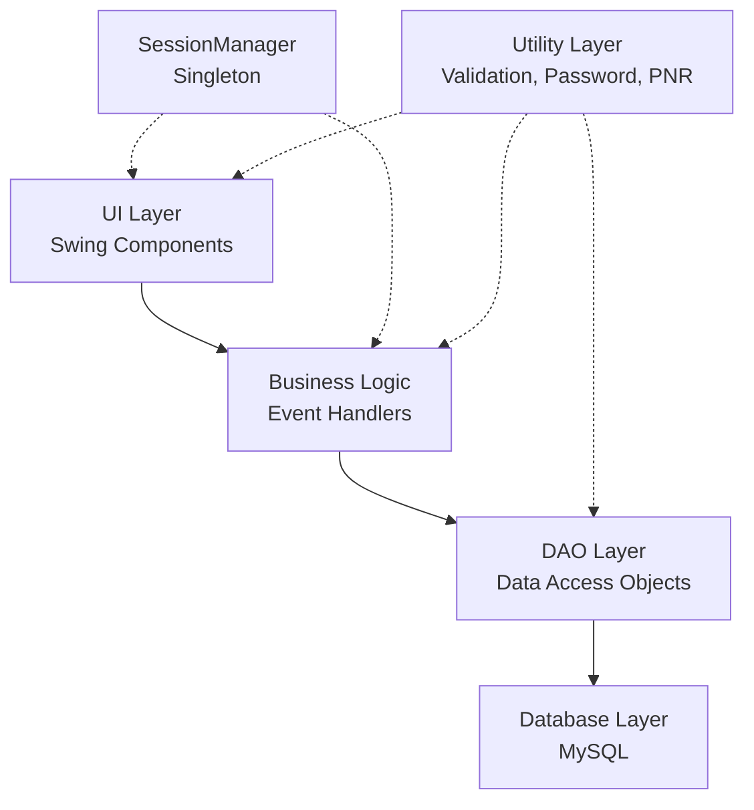
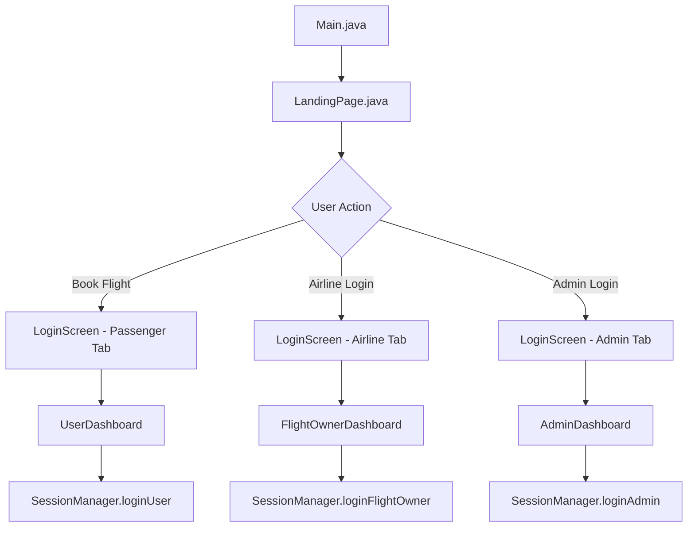
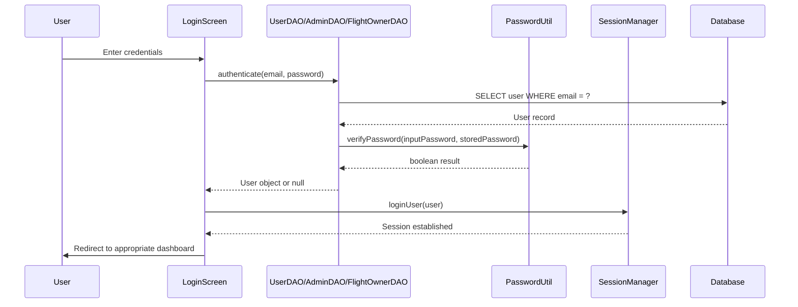
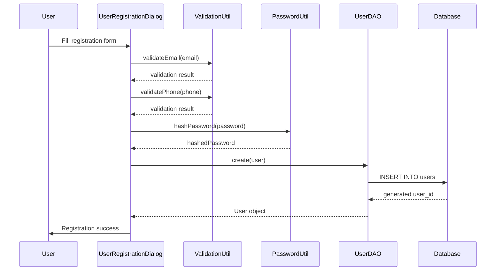
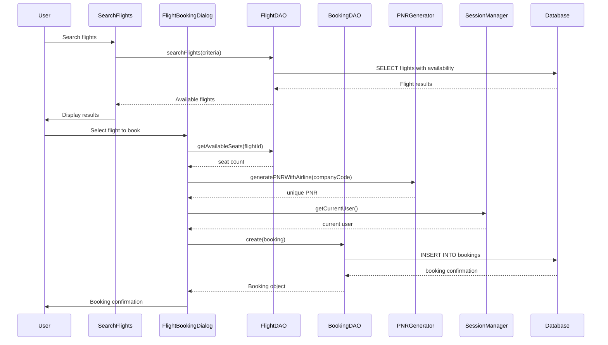

# GoAero Flight Booking System - Developer Guide

**Last Updated:** October 23, 2025

## Table of Contents

1. [Application Overview](#application-overview)
2. [Architecture & Design Patterns](#architecture--design-patterns)
3. [User Flow & Navigation](#user-flow--navigation)
4. [Core Components Deep Dive](#core-components-deep-dive)
5. [Key Workflows with Sequence Diagrams](#key-workflows-with-sequence-diagrams)
6. [Database Schema](#database-schema)
7. [UI Component Hierarchy & Styling](#ui-component-hierarchy--styling)
8. [Code Examples & Patterns](#code-examples--patterns)
9. [Development Setup & Build Process](#development-setup--build-process)
10. [Common Development Tasks](#common-development-tasks)
11. [Recent UI Enhancements](#recent-ui-enhancements)

---

## 1. Application Overview

### Purpose
GoAero is a comprehensive multi-user flight booking system supporting three distinct user roles:
- **Passengers**: Search, book, and manage flight reservations
- **Flight Owners (Airlines)**: Manage flights, view bookings, and track revenue
- **Administrators**: System-wide management of users, airports, flights, and bookings

### Technology Stack
- **Frontend**: Java Swing with modern UI styling
- **Backend**: Pure Java with layered architecture
- **Database**: MySQL 8.0+ with JDBC connectivity
- **Security**: BCrypt password hashing (via PasswordUtil)
- **Build**: Standard javac compilation with external JAR dependencies

### Project Directory Structure
```
src/
├── com/GoAero/
│   ├── main/           # Application entry point
│   ├── ui/             # Swing UI components and panels
│   ├── model/          # Data models and SessionManager
│   ├── dao/            # Data Access Objects
│   ├── util/           # Utility classes (validation, password, PNR)
│   └── db/             # Database connection management
├── database/           # SQL schema and setup scripts
└── lib/                # External dependencies (MySQL connector)
```

### Build and Execution Commands
```bash
# Compilation
find src -name "*.java" | xargs javac -cp ".:lib/*" -d bin

# Execution
java -cp ".:bin:lib/*" com.GoAero.main.Main
```

---

## 2. Architecture & Design Patterns

### Layered Architecture



### Design Patterns Implemented

#### 1. DAO (Data Access Object) Pattern
- **Purpose**: Encapsulate database operations and provide clean separation between business logic and data persistence
- **Implementation**: All DAO classes implement `BaseDAO<T, ID>` interface
- **Examples**: `UserDAO`, `FlightDAO`, `BookingDAO`, `FlightOwnerDAO`, `AdminDAO`, `AirportDAO`

#### 2. Singleton Pattern
- **Class**: `SessionManager`
- **Purpose**: Maintain single instance of user session state across the application
- **Usage**: `SessionManager.getInstance().getCurrentUser()`

#### 3. MVC-Inspired Separation
- **Models**: Data classes in `com.GoAero.model` package
- **Views**: UI panels and frames in `com.GoAero.ui` package  
- **Controllers**: Event handlers within UI classes that coordinate between views and models

### Package Responsibilities

| Package | Responsibility | Key Classes |
|---------|---------------|-------------|
| `main` | Application entry point | `Main.java` |
| `ui` | User interface components | `LandingPage`, `LoginScreen`, `UserDashboard`, `AdminDashboard`, `FlightOwnerDashboard` |
| `model` | Data models and session management | `User`, `Flight`, `Booking`, `FlightOwner`, `Admin`, `SessionManager` |
| `dao` | Database operations | `UserDAO`, `FlightDAO`, `BookingDAO`, `BaseDAO` |
| `util` | Utility functions | `ValidationUtil`, `PasswordUtil`, `PNRGenerator` |
| `db` | Database connectivity | `DBConnection` |

---

## 3. User Flow & Navigation

### Application Startup Flow



### Authentication Flow



### Session Management
- **SessionManager Singleton**: Tracks current user across application lifecycle
- **User Types**: `USER`, `ADMIN`, `FLIGHT_OWNER`, `NONE`
- **Session Methods**: `loginUser()`, `loginAdmin()`, `loginFlightOwner()`, `logout()`
- **Permission Checking**: `hasPermission(String permission)` for role-based access control

### Logout Flow
All dashboards return to `LandingPage` after calling `SessionManager.getInstance().logout()`

---

## 4. Core Components Deep Dive

### Model Layer (`com.GoAero.model`)

#### Key Classes
- **User**: Passenger information (firstName, lastName, email, phone, dateOfBirth, passwordHash)
- **FlightOwner**: Airline company details (companyName, companyCode, contactInfo, flightCount, password)
- **Flight**: Flight information with extended display fields (flightCode, capacity, price, departureTime, availableSeats)
- **Booking**: Reservation details (userId, flightId, pnr, amount, paymentStatus, bookingStatus)
- **Admin**: System administrator (username, passwordHash)
- **SessionManager**: Singleton for session state management

#### SessionManager Implementation Pattern
```java
public class SessionManager {
    private static SessionManager instance;
    private User currentUser;
    private UserType currentUserType;
    
    private SessionManager() { /* private constructor */ }
    
    public static SessionManager getInstance() {
        if (instance == null) {
            instance = new SessionManager();
        }
        return instance;
    }
}
```

### DAO Layer (`com.GoAero.dao`)

#### BaseDAO Interface
All DAO classes implement standard CRUD operations:
```java
public interface BaseDAO<T, ID> {
    T create(T entity);
    T findById(ID id);
    List<T> findAll();
    boolean update(T entity);
    boolean delete(ID id);
    boolean exists(ID id);
    long count();
}
```

#### Connection Management Pattern
```java
try (Connection conn = DBConnection.getConnection();
     PreparedStatement stmt = conn.prepareStatement(SQL_QUERY)) {
    // Database operations
} catch (SQLException e) {
    // Error handling
}
```

### UI Layer (`com.GoAero.ui`)

#### Main Frames
- **LandingPage**: Application entry point with navigation to login screens
- **LoginScreen**: Tabbed interface for Passenger/Admin/Airline authentication
- **UserDashboard**: Passenger main interface (search flights, view bookings, profile)
- **AdminDashboard**: System administration with tabbed management panels
- **FlightOwnerDashboard**: Airline management interface with flight operations

#### Reusable Panels
- **OwnerProfilePanel**: Flight owner profile management with modern styling
- **OwnerFlightManagementPanel**: Flight CRUD operations for airlines
- **BookingManagementPanel**: Admin booking oversight and status updates
- **UserManagementPanel**: Admin user account management

### Utility Classes (`com.GoAero.util`)

#### ValidationUtil
- **Email validation**: RFC-compliant email pattern matching
- **Phone validation**: International format support with cleaning
- **Airport/Flight code validation**: IATA standard format checking
- **Date validation**: Age restrictions and future date validation
- **Input sanitization**: Formatting and cleaning methods

#### PasswordUtil  
- **Password hashing**: BCrypt implementation for secure storage
- **Password verification**: Secure comparison methods
- **Strength validation**: Minimum requirements enforcement
- **Random generation**: Secure password generation utilities

#### PNRGenerator
- **Standard PNR**: 6-character alphanumeric codes
- **Airline-prefixed PNR**: Company code + random characters
- **Timestamped PNR**: Date prefix + random characters
- **Validation**: Format checking and sanitization

### Database Connection (`com.GoAero.db`)

#### DBConnection Class
```java
public class DBConnection {
    private static final String DB_URL = "jdbc:mysql://localhost:3306/goAero";
    private static final String USER = "root";
    private static final String PASS = "QWERTY";
    
    public static Connection getConnection() {
        // MySQL JDBC driver registration and connection establishment
    }
}
```

---

## 5. Key Workflows with Sequence Diagrams

### User Registration Workflow



### Flight Booking Workflow



---

## 6. Database Schema

### Core Tables

| Table | Purpose | Key Fields |
|-------|---------|------------|
| `users` | Passenger accounts | user_id, first_name, last_name, email, phone, DOB, password |
| `admin_users` | System administrators | admin_id, username, password_hash |
| `flight_owners` | Airline companies | owner_id, company_name, company_code, contact_info, flight_count |
| `airports` | Airport information | airport_id, airport_code, airport_name, city, country |
| `flight_data` | Flight schedules | flight_id, company_id, flight_code, capacity, departure_time, price |
| `bookings` | Flight reservations | booking_id, user_id, flight_id, PNR, amount, payment_status, booking_status |

### Relationships
- `flight_data.company_id` → `flight_owners.owner_id`
- `flight_data.departure_airport_id` → `airports.airport_id`
- `flight_data.destination_airport_id` → `airports.airport_id`
- `bookings.user_id` → `users.user_id`
- `bookings.flight_id` → `flight_data.flight_id`

### DAO Mapping
Each table has a corresponding DAO class that handles CRUD operations and complex queries with JOIN statements for enriched data retrieval.

**Note**: Actual schema details should be verified from the database as this documentation reflects the codebase structure.

---

## 7. UI Component Hierarchy & Styling

### JFrame Hierarchy
```
JFrame (Main Windows)
├── LandingPage
├── LoginScreen
├── UserDashboard
├── AdminDashboard
└── FlightOwnerDashboard
    └── JPanels (Content Areas)
        ├── Header Panels
        ├── Navigation Panels
        └── Content Panels (Tabbed or Card Layout)
```

### Layout Managers Used
- **BorderLayout**: Main frame layouts (header, center, footer)
- **GridBagLayout**: Complex forms with precise positioning
- **BoxLayout**: Vertical/horizontal component stacking
- **GridLayout**: Uniform grid arrangements
- **CardLayout**: Switchable content panels

### Modern UI Color Scheme Constants
```java
private static final Color PRIMARY_BLUE = new Color(25, 118, 210);
private static final Color ACCENT_ORANGE = new Color(255, 152, 0);
private static final Color DARK_BLUE = new Color(13, 71, 161);
private static final Color LIGHT_GRAY = new Color(245, 245, 245);
private static final Color HOVER_BLUE = new Color(30, 136, 229);
private static final Color SUCCESS_GREEN = new Color(76, 175, 80);
private static final Color BACKGROUND_GRAY = new Color(250, 250, 250);
private static final Color CARD_WHITE = Color.WHITE;
private static final Color DANGER_RED = new Color(244, 67, 54);
```

### Common UI Patterns

#### Styled Button Creation
```java
private JButton createStyledButton(String text, Color bgColor, Color textColor, int fontSize) {
    JButton button = new JButton(text);
    button.setFont(new Font("Arial", Font.BOLD, fontSize));
    button.setBackground(bgColor);
    button.setForeground(textColor);
    button.setFocusPainted(false);
    button.setBorderPainted(false);
    button.setCursor(new Cursor(Cursor.HAND_CURSOR));
    // Add hover effects
    return button;
}
```

#### Styled Text Field Creation
```java
private JTextField createStyledTextField(String placeholder) {
    JTextField field = new JTextField();
    field.setFont(new Font("Arial", Font.PLAIN, 14));
    field.setBorder(BorderFactory.createCompoundBorder(
        BorderFactory.createLineBorder(LIGHT_GRAY, 1),
        BorderFactory.createEmptyBorder(8, 12, 8, 12)
    ));
    return field;
}
```

#### ScrollPane Usage
For content overflow management (implemented in OwnerProfilePanel):
```java
JScrollPane scrollPane = new JScrollPane(contentPanel);
scrollPane.setVerticalScrollBarPolicy(JScrollPane.VERTICAL_SCROLLBAR_AS_NEEDED);
scrollPane.setHorizontalScrollBarPolicy(JScrollPane.HORIZONTAL_SCROLLBAR_NEVER);
```

---

## 8. Code Examples & Patterns

### Creating a New DAO Class Template
```java
public class ExampleDAO implements BaseDAO<Example, Integer> {
    private static final String INSERT_SQL = "INSERT INTO examples (field1, field2) VALUES (?, ?)";
    private static final String SELECT_BY_ID = "SELECT * FROM examples WHERE id = ?";
    
    @Override
    public Example create(Example entity) {
        try (Connection conn = DBConnection.getConnection();
             PreparedStatement stmt = conn.prepareStatement(INSERT_SQL, Statement.RETURN_GENERATED_KEYS)) {
            
            stmt.setString(1, entity.getField1());
            stmt.setString(2, entity.getField2());
            
            int affectedRows = stmt.executeUpdate();
            if (affectedRows > 0) {
                try (ResultSet generatedKeys = stmt.getGeneratedKeys()) {
                    if (generatedKeys.next()) {
                        entity.setId(generatedKeys.getInt(1));
                        return entity;
                    }
                }
            }
        } catch (SQLException e) {
            e.printStackTrace();
        }
        return null;
    }
    
    @Override
    public Example findById(Integer id) {
        try (Connection conn = DBConnection.getConnection();
             PreparedStatement stmt = conn.prepareStatement(SELECT_BY_ID)) {
            
            stmt.setInt(1, id);
            try (ResultSet rs = stmt.executeQuery()) {
                if (rs.next()) {
                    return mapResultSetToEntity(rs);
                }
            }
        } catch (SQLException e) {
            e.printStackTrace();
        }
        return null;
    }
    
    private Example mapResultSetToEntity(ResultSet rs) throws SQLException {
        // Map database columns to entity fields
        return new Example(rs.getInt("id"), rs.getString("field1"), rs.getString("field2"));
    }
}
```

### Creating a New UI Panel with Modern Styling
```java
public class ExamplePanel extends JPanel {
    private static final Color PRIMARY_BLUE = new Color(25, 118, 210);
    private static final Color CARD_WHITE = Color.WHITE;
    
    public ExamplePanel() {
        initializeComponents();
        setupLayout();
        setupEventHandlers();
    }
    
    private void initializeComponents() {
        setBackground(CARD_WHITE);
        setBorder(BorderFactory.createEmptyBorder(20, 20, 20, 20));
        
        // Create styled components
        JButton actionButton = createStyledButton("Action", PRIMARY_BLUE, Color.WHITE, 14);
        JTextField inputField = createStyledTextField("Enter text...");
    }
    
    private void setupLayout() {
        setLayout(new GridBagLayout());
        GridBagConstraints gbc = new GridBagConstraints();
        gbc.insets = new Insets(10, 10, 10, 10);
        
        // Add components with constraints
        gbc.gridx = 0; gbc.gridy = 0;
        add(inputField, gbc);
        
        gbc.gridx = 1; gbc.gridy = 0;
        add(actionButton, gbc);
    }
}
```

### Using SessionManager to Get Current User
```java
// Get current user
SessionManager sessionManager = SessionManager.getInstance();
if (sessionManager.isUserLoggedIn()) {
    User currentUser = sessionManager.getCurrentUser();
    // Use current user data
} else if (sessionManager.isFlightOwnerLoggedIn()) {
    FlightOwner currentOwner = sessionManager.getCurrentFlightOwner();
    // Use flight owner data
}

// Check permissions
if (sessionManager.hasPermission("user_booking")) {
    // Allow booking operations
}
```

### Implementing Form Validation
```java
private boolean validateForm() {
    StringBuilder errors = new StringBuilder();
    
    // Validate email
    if (!ValidationUtil.isValidEmail(emailField.getText())) {
        errors.append("- ").append(ValidationUtil.getEmailErrorMessage()).append("\n");
    }
    
    // Validate phone
    if (!ValidationUtil.isValidPhone(phoneField.getText())) {
        errors.append("- ").append(ValidationUtil.getPhoneErrorMessage()).append("\n");
    }
    
    // Validate password
    if (!PasswordUtil.isValidPassword(new String(passwordField.getPassword()))) {
        errors.append("- ").append(PasswordUtil.getPasswordRequirements()).append("\n");
    }
    
    if (errors.length() > 0) {
        showError("Please fix the following errors:\n" + errors.toString());
        return false;
    }
    
    return true;
}
```

### Creating Custom Styled Dialogs
```java
private void showError(String message) {
    JDialog dialog = new JDialog(this, "Error", true);
    dialog.setLayout(new BorderLayout());
    
    JPanel content = new JPanel(new BorderLayout());
    content.setBorder(new EmptyBorder(20, 20, 20, 20));
    content.setBackground(Color.WHITE);
    
    JLabel messageLabel = new JLabel("<html><div style='text-align: center;'>" + message + "</div></html>");
    messageLabel.setFont(new Font("Arial", Font.PLAIN, 14));
    content.add(messageLabel, BorderLayout.CENTER);
    
    JButton okButton = createStyledButton("OK", PRIMARY_BLUE, Color.WHITE, 12);
    okButton.addActionListener(e -> dialog.dispose());
    
    JPanel buttonPanel = new JPanel(new FlowLayout());
    buttonPanel.setOpaque(false);
    buttonPanel.add(okButton);
    content.add(buttonPanel, BorderLayout.SOUTH);
    
    dialog.add(content);
    dialog.setSize(400, 200);
    dialog.setLocationRelativeTo(this);
    dialog.setVisible(true);
}
```

---

## 9. Development Setup & Build Process

### Prerequisites
- **JDK 11+**: Required for compilation and execution
- **MySQL 8.0+**: Database server
- **MySQL Connector/J**: JDBC driver (included in `src/lib/`)

### Directory Structure Setup
1. Clone repository to local development environment
2. Ensure `src/lib/mysql-connector-j-9.3.0.jar` is present
3. Create `bin/` directory for compiled classes
4. Configure database connection in `DBConnection.java`

### Database Configuration
Update connection parameters in `src/com/GoAero/db/DBConnection.java`:
```java
private static final String DB_URL = "jdbc:mysql://localhost:3306/goAero";
private static final String USER = "your_username";
private static final String PASS = "your_password";
```

### Compilation Command
```bash
# Create bin directory if it doesn't exist
mkdir -p bin

# Compile all Java files
find src -name "*.java" | xargs javac -cp ".:lib/*" -d bin

# Alternative using specific classpath
javac -cp ".:src/lib/mysql-connector-j-9.3.0.jar" -d bin src/com/GoAero/**/*.java
```

### Execution Command
```bash
# Run the application
java -cp ".:bin:lib/*" com.GoAero.main.Main

# Alternative with specific classpath
java -cp ".:bin:src/lib/mysql-connector-j-9.3.0.jar" com.GoAero.main.Main
```

### Database Setup
1. Create MySQL database: `CREATE DATABASE goAero;`
2. Execute schema: `mysql -u root -p goAero < src/database/schema.sql`
3. Verify tables are created and relationships are established

---

## 10. Common Development Tasks

### Adding a New User Role

1. **Modify SessionManager**:
   ```java
   public enum UserType {
       USER, ADMIN, FLIGHT_OWNER, NEW_ROLE, NONE
   }
   
   private NewRole currentNewRole;
   
   public void loginNewRole(NewRole newRole) {
       logout();
       this.currentNewRole = newRole;
       this.currentUserType = UserType.NEW_ROLE;
   }
   ```

2. **Create DAO class**: Implement `BaseDAO<NewRole, Integer>`
3. **Add login tab**: Modify `LoginScreen` to include new role tab
4. **Create dashboard**: New main interface extending `JFrame`
5. **Update permissions**: Add role-specific permissions in `SessionManager.hasPermission()`

### Creating a New Panel

1. **Panel Structure Template**:
   ```java
   public class NewPanel extends JPanel {
       // Color constants
       private static final Color PRIMARY_BLUE = new Color(25, 118, 210);
       
       public NewPanel() {
           initializeComponents();
           setupLayout();
           setupEventHandlers();
       }
       
       private void initializeComponents() { /* Create components */ }
       private void setupLayout() { /* Arrange components */ }
       private void setupEventHandlers() { /* Add listeners */ }
   }
   ```

2. **Integration**: Add to parent frame using `tabbedPane.addTab()` or `cardLayout.add()`
3. **Styling**: Use consistent color scheme and `createStyledButton()` methods

### Adding a New Entity

1. **Model Class**: Create in `com.GoAero.model` with appropriate fields and constructors
2. **DAO Class**: Implement `BaseDAO<Entity, ID>` with CRUD operations
3. **UI Components**: Create management panel, dialog forms, and table displays
4. **Database**: Add table to schema and update foreign key relationships

### Troubleshooting Common Issues

#### JDBC Driver Not Found
- Ensure `mysql-connector-j-9.3.0.jar` is in classpath
- Verify JAR file is not corrupted
- Check Java version compatibility

#### Layout Overlaps
- Use `GridBagConstraints` with proper `insets` and `anchor` settings
- Implement `ScrollPane` for content overflow
- Test with different window sizes and resolutions

#### Session State Bugs
- Always call `SessionManager.getInstance().logout()` before new login
- Check `currentUserType` before accessing user-specific data
- Implement proper null checks for session data

---

## 11. Recent UI Enhancements

### Modern UI Styling Approach
- **Consistent Color Palette**: Professional blue/orange theme across all components
- **Hover Effects**: Interactive feedback for buttons and clickable elements
- **Rounded Borders**: Subtle border radius for modern appearance
- **Icon Integration**: Emoji icons for improved visual hierarchy
- **Typography**: Arial font family with appropriate weight and sizing

### Layout Fixes in OwnerProfilePanel
- **GridBagLayout Implementation**: Precise component positioning with proper spacing
- **ScrollPane Integration**: Handles content overflow gracefully
- **Responsive Design**: Adapts to different window sizes
- **Form Validation**: Real-time input validation with user feedback

### Window Management in FlightOwnerDashboard
- **Maximized State**: Opens in full-screen mode for optimal workspace
- **Minimum Size Constraints**: Prevents UI breaking at small sizes
- **Resizable Interface**: Flexible layout that adapts to window changes

### Best Practices for New Components

1. **Color Consistency**: Always use defined color constants
2. **Hover States**: Implement mouse enter/exit listeners for interactive elements
3. **Accessibility**: Provide tooltips and keyboard navigation support
4. **Error Handling**: Graceful degradation with user-friendly error messages
5. **Performance**: Efficient repainting and component updates

### Component Styling Guidelines
- Use `createStyledButton()` for consistent button appearance
- Implement `EmptyBorder` for proper spacing and padding
- Apply `setFocusPainted(false)` to remove default focus indicators
- Use `setCursor(Cursor.HAND_CURSOR)` for interactive elements

---

This developer guide provides comprehensive coverage of the GoAero Flight Booking System architecture, implementation patterns, and development workflows. New developers should be able to understand the codebase structure and begin contributing effectively after reviewing this documentation.

For additional technical details or specific implementation questions, refer to the inline code documentation and existing class implementations as authoritative sources.
