# GoAero UI Components Guide

**Last Updated:** October 23, 2025

## Table of Contents
1. [Overview](#overview)
2. [UI Components by Role - Organized Tables](#ui-components-by-role---organized-tables)
3. [Detailed Component Descriptions](#detailed-component-descriptions)
4. [UI Component Hierarchy Diagram](#ui-component-hierarchy-diagram)
5. [Component Interaction Patterns](#component-interaction-patterns)
6. [Quick Reference Matrix](#quick-reference-matrix)
7. [Developer Notes](#developer-notes)

## Overview

### UI Layer Architecture
The GoAero flight booking system follows a modern Java Swing-based UI architecture with clear separation of concerns. The UI layer is organized around three primary user roles, each with dedicated interfaces and workflows.

### User Roles
- **Passenger (User)**: End customers who search for flights, make bookings, and manage their travel
- **Flight Owner (Airline)**: Airline companies that manage flight schedules, view booking statistics, and handle operations
- **Admin**: System administrators who oversee users, airports, flights, and generate reports

### Common UI Components
The application uses a consistent design system with:
- Modern Material Design-inspired color scheme (Primary Blue: #1976D2, Accent Orange: #FF9800)
- Standardized button styles with hover effects
- Consistent form layouts and validation patterns
- Professional typography using Arial font family
- Responsive panels and dialogs with proper spacing

## UI Components by Role - Organized Tables

### A. Common/Shared UI Components
| File Name | Purpose | Entry Point | Key Features | Navigation Flow |
|-----------|---------|-------------|--------------|----------------|
| `LandingPage.java` | Application entry point with role-based navigation | App startup | Hero section, role-based login routing, professional branding | Entry → LoginScreen (tab-based) |
| `LoginScreen.java` | Unified authentication for all user types | LandingPage | Tabbed interface (Passenger/Admin/Airline), registration links, session management | LandingPage → Role-specific Dashboard |

### B. Passenger/User Role Components  
| File Name | Purpose | Accessed From | Key Functionality | Related DAOs |
|-----------|---------|---------------|-------------------|--------------|
| `UserDashboard.java` | Main passenger portal | LoginScreen | Flight search access, booking history, profile management | None (navigation hub) |
| `SearchFlights.java` | Flight search and selection interface | UserDashboard | Airport selection, date filtering, real-time availability, booking initiation | AirportDAO, FlightDAO |
| `FlightBookingDialog.java` | Flight booking confirmation and payment | SearchFlights | Booking details review, PNR generation, payment processing | BookingDAO, FlightDAO |
| `BookingHistory.java` | View and manage user bookings | UserDashboard | Booking list, status tracking, cancellation, details view | BookingDAO |
| `BookingDetailsDialog.java` | Detailed booking information | BookingHistory | Full booking details, receipt view, travel information | BookingDAO |
| `UserProfileDialog.java` | User account management | UserDashboard | Profile editing, password change, personal information update | UserDAO |
| `UserRegistrationDialog.java` | New passenger account creation | LoginScreen | Account creation, validation, email verification | UserDAO |

### C. Flight Owner/Airline Role Components
| File Name | Purpose | Accessed From | Key Functionality | Related DAOs |
|-----------|---------|---------------|-------------------|--------------|
| `FlightOwnerDashboard.java` | Main airline management portal | LoginScreen | Flight operations hub, analytics access, profile management | None (navigation hub) |
| `OwnerFlightManagementPanel.java` | Flight schedule management | FlightOwnerDashboard | Flight CRUD operations, schedule management, capacity planning | FlightDAO |
| `OwnerFlightDialog.java` | Flight creation and editing | OwnerFlightManagementPanel | Flight details form, route configuration, pricing setup | FlightDAO, AirportDAO |
| `OwnerBookingStatsPanel.java` | Booking analytics and reports | FlightOwnerDashboard | Revenue analytics, booking trends, passenger statistics | BookingDAO, FlightDAO |
| `OwnerProfilePanel.java` | Airline company profile management | FlightOwnerDashboard | Company information, contact details, operational settings | FlightOwnerDAO |
| `FlightOwnerRegistrationDialog.java` | New airline registration | LoginScreen | Company registration, verification, credential setup | FlightOwnerDAO |

### D. Admin Role Components
| File Name | Purpose | Accessed From | Key Functionality | Related DAOs |
|-----------|---------|---------------|-------------------|--------------|
| `AdminDashboard.java` | System administration hub | LoginScreen | Tabbed management interface, system oversight, reporting | None (navigation hub) |
| `UserManagementPanel.java` | Passenger account administration | AdminDashboard | User CRUD operations, account status management, passenger oversight | UserDAO |
| `AirportManagementPanel.java` | Airport system management | AdminDashboard | Airport CRUD operations, location management, code administration | AirportDAO |
| `FlightOwnerManagementPanel.java` | Airline company administration | AdminDashboard | Airline CRUD operations, verification, approval processes | FlightOwnerDAO |
| `FlightManagementPanel.java` | System-wide flight oversight | AdminDashboard | All flights management, cross-airline monitoring, scheduling oversight | FlightDAO |
| `BookingManagementPanel.java` | Booking system administration | AdminDashboard | Booking oversight, issue resolution, system-wide booking analytics | BookingDAO |
| `ReportsPanel.java` | System analytics and reporting | AdminDashboard | Comprehensive reports, system metrics, business intelligence | BookingDAO, FlightDAO, UserDAO, FlightOwnerDAO |
| `AdminUserDialog.java` | User account editing | UserManagementPanel | Admin-level user editing, account permissions, status changes | UserDAO |
| `AdminAirportDialog.java` | Airport configuration | AirportManagementPanel | Airport creation/editing, location settings, operational parameters | AirportDAO |
| `AdminFlightDialog.java` | Flight administration | FlightManagementPanel | System-level flight editing, cross-airline management | FlightDAO, AirportDAO, FlightOwnerDAO |
| `AdminFlightOwnerDialog.java` | Airline company administration | FlightOwnerManagementPanel | Airline verification, approval, configuration | FlightOwnerDAO |

## Detailed Component Descriptions

### Common/Shared Components

#### `LandingPage.java`
- **Component Type**: JFrame (Main Window)
- **Role Association**: Common (Entry Point)
- **Purpose**: Professional landing page serving as the application's first impression and primary navigation hub
- **Navigation Path**: Application Start → LandingPage
- **Key Features**:
  - Hero section with aviation-themed branding
  - Primary "Book a Flight" button (routes to passenger login)
  - "Airline Partner Login" button (routes to airline login)
  - Discrete admin access link in footer
  - Modern background with gradient overlay
- **Related Components**: Routes to LoginScreen with appropriate tab selection
- **DAO Dependencies**: None

#### `LoginScreen.java`
- **Component Type**: JFrame (Main Window)
- **Role Association**: Common (Authentication Hub)
- **Purpose**: Unified authentication interface supporting all three user roles with modern tabbed design
- **Navigation Path**: LandingPage → LoginScreen → Role Dashboard
- **Key Features**:
  - Three-tab interface: Passenger, Admin, Airline
  - Placeholder text for enhanced UX
  - Registration buttons for Passenger and Airline roles
  - Session management integration
  - Modern styled form validation
- **Related Components**: LandingPage (entry), UserDashboard, AdminDashboard, FlightOwnerDashboard (destinations)
- **DAO Dependencies**: UserDAO, AdminDAO, FlightOwnerDAO

### Passenger/User Components

#### `UserDashboard.java`
- **Component Type**: JFrame (Main Window)
- **Role Association**: Passenger
- **Purpose**: Central hub for passenger operations with intuitive navigation to all passenger services
- **Accessed From**: LoginScreen (successful passenger login)
- **Navigation Path**: LandingPage → LoginScreen → UserDashboard
- **Key Features**:
  - Welcome message with personalized greeting
  - Large action buttons for primary tasks
  - Flight search launch point
  - Booking history access
  - Profile management access
  - Modern logout confirmation dialog
- **Related Components**: SearchFlights, BookingHistory, UserProfileDialog
- **DAO Dependencies**: None (navigation hub)

#### `SearchFlights.java`
- **Component Type**: JFrame (Main Window)
- **Role Association**: Passenger
- **Purpose**: Comprehensive flight search interface with real-time availability and booking capabilities
- **Accessed From**: UserDashboard
- **Navigation Path**: LandingPage → LoginScreen → UserDashboard → SearchFlights
- **Key Features**:
  - Airport dropdown selection with search
  - Date picker with validation
  - Real-time flight results table
  - Availability and pricing display
  - Direct booking initiation
  - Return to dashboard functionality
- **Related Components**: UserDashboard (parent), FlightBookingDialog (child)
- **DAO Dependencies**: AirportDAO, FlightDAO

#### `FlightBookingDialog.java`
- **Component Type**: JDialog (Modal Dialog)
- **Role Association**: Passenger
- **Purpose**: Secure flight booking confirmation and payment processing interface
- **Accessed From**: SearchFlights
- **Navigation Path**: LandingPage → LoginScreen → UserDashboard → SearchFlights → FlightBookingDialog
- **Key Features**:
  - Flight details confirmation
  - Passenger information review
  - Price calculation and display
  - PNR generation
  - Booking confirmation with receipt
- **Related Components**: SearchFlights (parent)
- **DAO Dependencies**: BookingDAO, FlightDAO

#### `BookingHistory.java`
- **Component Type**: JFrame (Main Window)
- **Role Association**: Passenger
- **Purpose**: Comprehensive booking management interface for tracking and managing travel history
- **Accessed From**: UserDashboard
- **Navigation Path**: LandingPage → LoginScreen → UserDashboard → BookingHistory
- **Key Features**:
  - Tabular booking display with status indicators
  - Booking cancellation capability
  - Detail view access
  - Status-based filtering
  - Modern empty state for new users
- **Related Components**: UserDashboard (parent), BookingDetailsDialog (child)
- **DAO Dependencies**: BookingDAO

### Flight Owner/Airline Components

#### `FlightOwnerDashboard.java`
- **Component Type**: JFrame (Main Window)
- **Role Association**: Flight Owner (Airline)
- **Purpose**: Professional airline management portal with comprehensive operational oversight
- **Accessed From**: LoginScreen (successful airline login)
- **Navigation Path**: LandingPage → LoginScreen → FlightOwnerDashboard
- **Key Features**:
  - Company branding with airline code display
  - Tabbed interface for different management areas
  - Flight operations management
  - Analytics and reporting access
  - Company profile management
  - Professional airline-themed design
- **Related Components**: OwnerFlightManagementPanel, OwnerBookingStatsPanel, OwnerProfilePanel
- **DAO Dependencies**: None (navigation hub)

#### `OwnerFlightManagementPanel.java`
- **Component Type**: JPanel (Embedded Panel)
- **Role Association**: Flight Owner (Airline)
- **Purpose**: Comprehensive flight operations management for airline companies
- **Accessed From**: FlightOwnerDashboard (tab)
- **Navigation Path**: LandingPage → LoginScreen → FlightOwnerDashboard → Flight Operations Tab
- **Key Features**:
  - Flight schedule management
  - Route configuration
  - Capacity planning
  - Pricing management
  - Fleet overview
- **Related Components**: FlightOwnerDashboard (parent), OwnerFlightDialog (child)
- **DAO Dependencies**: FlightDAO

### Admin Components

#### `AdminDashboard.java`
- **Component Type**: JFrame (Main Window)
- **Role Association**: Admin
- **Purpose**: Comprehensive system administration interface with full operational oversight
- **Accessed From**: LoginScreen (successful admin login)
- **Navigation Path**: LandingPage → LoginScreen → AdminDashboard
- **Key Features**:
  - Tabbed management interface
  - User management access
  - Airport system administration
  - Airline oversight
  - Flight system management
  - Booking administration
  - Comprehensive reporting
- **Related Components**: UserManagementPanel, AirportManagementPanel, FlightOwnerManagementPanel, FlightManagementPanel, BookingManagementPanel, ReportsPanel
- **DAO Dependencies**: None (navigation hub)

## UI Component Hierarchy Diagram

```mermaid
flowchart TD
    Start([Application Start]) --> Landing[LandingPage.java]
    
    Landing --> Login[LoginScreen.java]
    
    Login --> UserDash[UserDashboard.java]
    Login --> AdminDash[AdminDashboard.java]
    Login --> OwnerDash[FlightOwnerDashboard.java]
    
    %% User Flow
    UserDash --> Search[SearchFlights.java]
    UserDash --> History[BookingHistory.java]
    UserDash --> UserProfile[UserProfileDialog.java]
    
    Search --> BookingDialog[FlightBookingDialog.java]
    History --> BookingDetails[BookingDetailsDialog.java]
    
    Login --> UserReg[UserRegistrationDialog.java]
    Login --> OwnerReg[FlightOwnerRegistrationDialog.java]
    
    %% Admin Flow
    AdminDash --> UserMgmt[UserManagementPanel.java]
    AdminDash --> AirportMgmt[AirportManagementPanel.java]
    AdminDash --> OwnerMgmt[FlightOwnerManagementPanel.java]
    AdminDash --> FlightMgmt[FlightManagementPanel.java]
    AdminDash --> BookingMgmt[BookingManagementPanel.java]
    AdminDash --> Reports[ReportsPanel.java]
    
    UserMgmt --> AdminUserDialog[AdminUserDialog.java]
    AirportMgmt --> AdminAirportDialog[AdminAirportDialog.java]
    OwnerMgmt --> AdminOwnerDialog[AdminFlightOwnerDialog.java]
    FlightMgmt --> AdminFlightDialog[AdminFlightDialog.java]
    
    %% Owner Flow
    OwnerDash --> OwnerFlightMgmt[OwnerFlightManagementPanel.java]
    OwnerDash --> OwnerStats[OwnerBookingStatsPanel.java]
    OwnerDash --> OwnerProfile[OwnerProfilePanel.java]
    
    OwnerFlightMgmt --> OwnerFlightDialog[OwnerFlightDialog.java]
    
    %% Styling
    classDef userClass fill:#e3f2fd,stroke:#1976d2,stroke-width:2px
    classDef adminClass fill:#fff3e0,stroke:#f57c00,stroke-width:2px
    classDef ownerClass fill:#e8f5e8,stroke:#4caf50,stroke-width:2px
    classDef commonClass fill:#f5f5f5,stroke:#424242,stroke-width:2px
    
    class UserDash,Search,History,UserProfile,BookingDialog,BookingDetails,UserReg userClass
    class AdminDash,UserMgmt,AirportMgmt,OwnerMgmt,FlightMgmt,BookingMgmt,Reports,AdminUserDialog,AdminAirportDialog,AdminOwnerDialog,AdminFlightDialog adminClass
    class OwnerDash,OwnerFlightMgmt,OwnerStats,OwnerProfile,OwnerFlightDialog,OwnerReg ownerClass
    class Landing,Login commonClass
```



## Component Interaction Patterns

### Dialog Opening Patterns
- **Parent-Child Modal Dialogs**: Most dialogs are opened modally from their parent components
  ```java
  new FlightBookingDialog(this, selectedFlight).setVisible(true);
  ```

- **Registration Dialogs**: Opened from LoginScreen for user and airline registration
  ```java
  new UserRegistrationDialog(this).setVisible(true);
  ```

### Panel Embedding Patterns
- **Dashboard Tabs**: Management panels are embedded as tabs in dashboard frames
  ```java
  tabbedPane.addTab("👥 Users", new UserManagementPanel());
  ```

### Data Flow Patterns
- **Search → Booking**: SearchFlights passes selected Flight object to FlightBookingDialog
- **Session Management**: All components check SessionManager for current user context
- **DAO Integration**: Each component initializes its required DAO objects in constructor

### Navigation Patterns
- **Back Navigation**: Most screens provide return-to-parent functionality
- **Dashboard Hubs**: Each role has a central dashboard serving as navigation hub
- **Cross-Role Prevention**: SessionManager prevents unauthorized access to role-specific components

## Quick Reference Matrix

| File Name | Component Type | Role | Parent Component | Entry Point? | Primary Purpose |
|-----------|---------------|------|------------------|--------------|-----------------|
| `LandingPage.java` | JFrame | Common | None | Yes | Application entry and role routing |
| `LoginScreen.java` | JFrame | Common | LandingPage | No | Authentication for all roles |
| `UserDashboard.java` | JFrame | Passenger | LoginScreen | No | Passenger operations hub |
| `SearchFlights.java` | JFrame | Passenger | UserDashboard | No | Flight search and selection |
| `FlightBookingDialog.java` | JDialog | Passenger | SearchFlights | No | Flight booking confirmation |
| `BookingHistory.java` | JFrame | Passenger | UserDashboard | No | Booking management |
| `BookingDetailsDialog.java` | JDialog | Passenger | BookingHistory | No | Detailed booking view |
| `UserProfileDialog.java` | JDialog | Passenger | UserDashboard | No | User account management |
| `UserRegistrationDialog.java` | JDialog | Passenger | LoginScreen | No | New user registration |
| `AdminDashboard.java` | JFrame | Admin | LoginScreen | No | System administration hub |
| `UserManagementPanel.java` | JPanel | Admin | AdminDashboard | No | User administration |
| `AirportManagementPanel.java` | JPanel | Admin | AdminDashboard | No | Airport system management |
| `FlightOwnerManagementPanel.java` | JPanel | Admin | AdminDashboard | No | Airline administration |
| `FlightManagementPanel.java` | JPanel | Admin | AdminDashboard | No | Flight system oversight |
| `BookingManagementPanel.java` | JPanel | Admin | AdminDashboard | No | Booking administration |
| `ReportsPanel.java` | JPanel | Admin | AdminDashboard | No | System analytics |
| `AdminUserDialog.java` | JDialog | Admin | UserManagementPanel | No | User account editing |
| `AdminAirportDialog.java` | JDialog | Admin | AirportManagementPanel | No | Airport configuration |
| `AdminFlightDialog.java` | JDialog | Admin | FlightManagementPanel | No | Flight administration |
| `AdminFlightOwnerDialog.java` | JDialog | Admin | FlightOwnerManagementPanel | No | Airline configuration |
| `FlightOwnerDashboard.java` | JFrame | Flight Owner | LoginScreen | No | Airline management hub |
| `OwnerFlightManagementPanel.java` | JPanel | Flight Owner | FlightOwnerDashboard | No | Flight operations management |
| `OwnerFlightDialog.java` | JDialog | Flight Owner | OwnerFlightManagementPanel | No | Flight creation/editing |
| `OwnerBookingStatsPanel.java` | JPanel | Flight Owner | FlightOwnerDashboard | No | Booking analytics |
| `OwnerProfilePanel.java` | JPanel | Flight Owner | FlightOwnerDashboard | No | Company profile management |
| `FlightOwnerRegistrationDialog.java` | JDialog | Flight Owner | LoginScreen | No | Airline registration |

## Developer Notes

### Naming Conventions
- **Role Prefixes**: Admin components start with "Admin", Owner components with "Owner"
- **Component Types**: Dialogs end with "Dialog", Panels with "Panel", Dashboards with "Dashboard"
- **Functionality**: Management panels typically include "Management" in the name

### Identifying Component Roles
1. **File Name Patterns**:
   - No prefix = Passenger/Common component
   - `Admin*` = Administrator component
   - `Owner*` = Flight Owner/Airline component

2. **SessionManager Checks**:
   - `SessionManager.getInstance().getCurrentUser()` = Passenger component
   - `SessionManager.getInstance().getCurrentAdmin()` = Admin component
   - `SessionManager.getInstance().getCurrentFlightOwner()` = Flight Owner component

3. **Import Patterns**:
   - Components import only the DAOs they need for data operations
   - Common pattern: `import com.GoAero.dao.*DAO;`

### Common UI Patterns
- **Color Scheme**: Consistent Material Design colors across all components
- **Button Styling**: `createStyledButton()` method with hover effects
- **Form Validation**: Centralized validation with error dialogs
- **Loading States**: Modern dialogs with fade-in animations

### Extension Guidelines
When creating new UI components:

1. **Follow Role Conventions**: Use appropriate prefixes for new components
2. **Extend Proper Base Class**: JFrame for main windows, JDialog for modals, JPanel for embedded components
3. **Implement Standard Patterns**: Use consistent button styling, color schemes, and validation patterns
4. **Handle Sessions**: Always verify user authentication and role permissions
5. **DAO Integration**: Initialize required DAOs in constructor and handle exceptions gracefully

### Architecture Benefits
- **Role Separation**: Clear boundaries between passenger, admin, and airline interfaces
- **Reusable Components**: Consistent styling and behavior patterns
- **Session Security**: Proper authentication checks throughout the application
- **Modern UX**: Professional design with intuitive navigation flows
